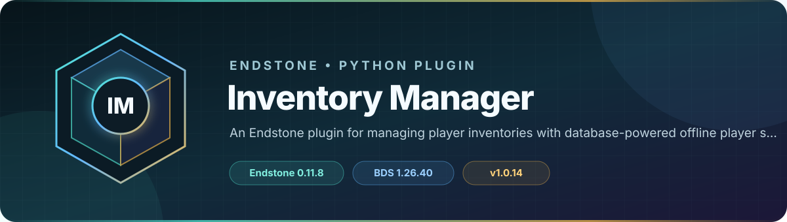

<!-- endstone-professional-header:start -->
<p align="center">
  
</p>

<p align="center">
  <a href="https://github.com/TheNINJALLO/endstone-inventory-manager/actions/workflows/wheel-release.yml"></a>
  <a href="https://github.com/TheNINJALLO/endstone-inventory-manager/releases/latest"></a>
</p>

<p align="center">
  
  
  
  =3.10" src="https://img.shields.io/badge/Python-%3E=3.10-3776AB?style=flat-square&amp;logo=python&amp;logoColor=white">
</p>

<p align="center">
  <strong>An Endstone plugin for managing player inventories with database-powered offline player support.</strong>
</p>

<p align="center">
  <a href="#overview">Overview</a> &bull;
  <a href="#compatibility">Compatibility</a> &bull;
  <a href="#install">Install</a> &bull;
  <a href="https://github.com/TheNINJALLO/endstone-inventory-manager/releases">Releases</a>
</p>

## Overview

An Endstone plugin for managing player inventories with database-powered offline player support. This release is aligned with Endstone 0.11.8 and Minecraft Bedrock Dedicated Server 1.26.40, and is distributed as a Python wheel for direct installation in an Endstone server.

## Capabilities

-

## Compatibility

| Component | Supported version |
|---|---|
| Endstone | `0.11.8` |
| Endstone API | `0.11` |
| Bedrock Dedicated Server | `1.26.40` |
| Python | `>=3.10` |
| Plugin release | `v1.0.14` |

## Install

Download the wheel from the matching GitHub release:

```bash
gh release download v1.0.14 --repo TheNINJALLO/endstone-inventory-manager --pattern "*.whl"
```

Copy the downloaded wheel into the server's `plugins/` directory, remove any older wheel for the same plugin, and restart Endstone.

> [!IMPORTANT]
> Use Endstone `0.11.8` with BDS `1.26.40`. Back up worlds and plugin data before upgrading a production server.

## Configuration and secrets

Runtime databases, logs, local `.env` files, server directories, and root `config.toml` files are excluded from source releases. When an example configuration is provided, copy it locally and keep live tokens, passwords, webhook URLs, and server identifiers out of Git.

## Release automation

Every `v*` tag runs [the wheel release workflow](.github/workflows/wheel-release.yml), builds the package in a clean GitHub runner, stores the wheel as a workflow artifact, and attaches it to the matching GitHub release.
<!-- endstone-professional-header:end -->

---

## Project guide

A comprehensive Endstone plugin that allows server administrators to view and manage player inventories and ender chests through an intuitive form-based interface. Supports both **online** and **offline** players!

## ✨ Features

### 🎮 Online Player Management
- **View Player Inventories**: Browse all slots in a player's inventory
- **View Ender Chests**: Access and manage player ender chest contents
- **Two View Modes**:
  - **Actions (List View)**: Perform operations on items
  - **View Only (Visual Chest)**: See items in a visual chest interface
- **Item Management**:
  - **Take**: Move items from player to your inventory (preserves NBT data)
  - **Copy**: Duplicate items to your inventory (preserves NBT data)
  - **Remove**: Clear items from slots
- **NBT Data Preservation**: Maintains enchantments, custom names, lore, shulker box contents, and all other NBT data

### 📦 Offline Player Support
- **Database-Powered**: Stores player inventory and ender chest data in SQLite database
- **View Offline Ender Chests**: Access ender chests of players who are offline
- **Copy Items**: Copy items from offline player ender chests to your inventory
- **Visual Display**: View offline ender chests in a visual chest interface
- **Read-Only Safety**: Cannot modify offline player data (view and copy only)
- **Text Search**: Search for players by name (supports partial matching and spaces)
- **NBT Fallback**: Falls back to reading NBT files for players who haven't joined since database was added

### 🎨 User Interface
- **Clean Menu Structure**: Organized hierarchical menus
- **Color-Coded Options**: Easy to distinguish between different actions
- **Visual Chest Forms**: See inventories as actual chest interfaces
- **Real-time Updates**: Works with live player data

## 📥 Installation

### Basic Installation

1. Install the plugin using pip:
   ```bash
   pip install endstone-inventory-manager
   ```

2. Restart your Endstone server

### Manual Installation

1. Copy the plugin to your Endstone server's `plugins` directory
2. Install dependencies:
   ```bash
   pip install rapidnbt>=1.1.5
   pip install chest_form_api_endstone>=1.0.0
   ```
3. Restart your server

## 📋 Requirements

### Core Requirements
- **Endstone** >= 0.5.0
- **Python** >= 3.11
- **Minecraft Bedrock Edition** server

### Optional Dependencies (for full features)
- **rapidnbt** >= 1.1.5 (for offline player support)
- **chest_form_api_endstone** >= 1.0.0 (for visual chest display)

> **Note**: Without optional dependencies, the plugin will still work but offline player viewing will be disabled.

## 🗄️ Database System

The plugin uses an **SQLite database** to store player inventory and ender chest data for offline viewing.

### How It Works

1. **Auto-Save on Join/Leave**: When players join or leave the server, their inventory and ender chest data is automatically saved to the database
2. **Database-First Search**: When searching for offline players, the plugin queries the database first for fast results
3. **NBT Fallback**: If a player isn't in the database (e.g., they haven't joined since the plugin was installed), the plugin falls back to reading their `.dat` file
4. **Thread-Safe**: Uses SQLite's WAL mode and threading locks for safe concurrent access

### Database Location

```
plugins/inventory_manager_data/inventories.db
```

### Database Tables

- **users**: Stores player information (XUID, name, join/leave times)
- **inventories**: Stores player inventory items with full NBT data
- **ender_chests**: Stores ender chest items with full NBT data

### Data Stored

For each item, the database stores:
- Item type, amount, damage value
- Display name, lore, enchantments
- Unbreakable flag and other NBT data
- Slot position

> **Note**: The database is automatically created on first run. No manual setup required!

## 🎯 Usage

### Command

```
/manageinv
```

Opens the inventory manager interface.

### Permissions

- `inventory_manager.use` - Allows using the inventory manager (default: OP)

### Menu Structure

```
/manageinv
├── Online Players
│   ├── Select Player
│   │   ├── Inventory
│   │   │   ├── Actions (List View) - Take/Copy/Remove items
│   │   │   └── View Only (Visual Chest) - Read-only visual display
│   │   └── Ender Chest
│   │       ├── Actions (List View) - Take/Copy/Remove items
│   │       └── View Only (Visual Chest) - Read-only visual display
│
└── Offline Players (Ender Chest Only)
    ├── Text Search (Enter player name)
    │   └── If multiple matches → Select Player
    └── Selected Player's Ender Chest
        ├── Actions (List View) - Copy items only
        └── View Only (Visual Chest) - Read-only visual display
```

### Workflow Examples

#### Managing Online Player Inventory

1. Run `/manageinv`
2. Select **"Online Players"**
3. Choose a player to inspect
4. Select **"Inventory"**
5. Choose view mode:
   - **Actions (List View)**: Click an item → Take/Copy/Remove
   - **View Only (Visual Chest)**: See all items in chest interface

#### Viewing Offline Player Ender Chest

1. Run `/manageinv`
2. Select **"Offline Players (Ender Chest Only)"**
3. **Enter player name** in the text search box (supports partial matching and spaces)
4. If multiple matches found, select the correct player
5. Choose view mode:
   - **Actions (List View)**: Click an item → Copy to your inventory
   - **View Only (Visual Chest)**: See all items in chest interface

**Search Tips:**
- Search is case-insensitive: "steve" matches "Steve"
- Partial matching: "The B" finds "The Builder", "The Boss", etc.
- Supports spaces: "Player Name" works correctly
- Single match: Shows ender chest directly
- Multiple matches: Shows selection menu

### Item Actions Explained

- **Take**: Removes the item from the target player and adds it to your inventory (online players only)
- **Copy**: Duplicates the item to your inventory while keeping the original (works for both online and offline)
- **Remove**: Deletes the item from the slot (online players only)

> **Important**: All actions preserve NBT data including enchantments, custom names, lore, and shulker box contents!

## ⚙️ Configuration

No configuration required. The plugin works out of the box.

### World Folder Detection

The plugin automatically detects player data in these locations:
- `worlds/Bedrock level/players/`
- `worlds/world/players/`
- `Bedrock level/players/`
- `world/players/`

## 🔧 Troubleshooting

### Offline Players Button Not Showing

Check the server logs for:
```
[WARNING] Offline player viewing is DISABLED - missing dependencies
[WARNING]   - RapidNBT not found (install RapidNBT)
```

**Solution**: Install RapidNBT:
```bash
pip install rapidnbt>=1.1.5
```

### Player Data Folder Not Found

**Error**: "Player data folder not found"

**Solution**: The plugin will show which paths it tried. Make sure your world folder structure matches one of:
- `worlds/Bedrock level/players/`
- `worlds/world/players/`

### Visual Chest Not Working

**Solution**: Install ChestForm API:
```bash
pip install chest_form_api_endstone>=1.0.0
```

## 🎨 Color Codes

The plugin uses Minecraft color codes for clarity:

- **§a (Green)**: Online Players, available actions
- **§e (Yellow)**: Offline Players, action buttons
- **§b (Cyan)**: View Only options
- **§6 (Gold)**: Inventory
- **§d (Pink/Magenta)**: Ender Chest
- **§7 (Gray)**: Notes and descriptions
- **§c (Red)**: Close/Cancel buttons

## 📝 Permissions

```yaml
inventory_manager.use:
  description: Allows using the inventory manager
  default: op
```

## ⚠️ Known Limitations

- **Offline players**: Only ender chests are accessible (not regular inventory)
- **Offline modifications**: Cannot modify offline player data (copy only)
- **NBT compatibility**: Some complex NBT structures may not display perfectly in visual mode
- **Inventory access**: Depends on Endstone API capabilities

## 🔒 Safety Features

- **Read-only offline access**: Offline player data is never modified
- **Inventory full checks**: Warns if your inventory is full before copying
- **Error handling**: Graceful failures with helpful error messages
- **Logging**: All operations are logged for debugging

## 📦 Dependencies

### Required
- `endstone` (automatically installed with Endstone)

### Optional
- `rapidnbt>=1.1.5` - For offline player NBT data reading
- `chest_form_api_endstone>=1.0.0` - For visual chest display

## 🐛 Bug Reports

If you encounter any issues, please check the server logs for error messages. Common issues are usually related to missing dependencies or incorrect world folder structure.

## 📄 License

MIT License

## 👤 Author

**TheN1NJ4LL0**

## 📌 Version

**0.3.0**

### Changelog

#### v0.3.0 (Database Update)
- **🗄️ Database System**: Implemented SQLite database for storing player inventory and ender chest data
- **Auto-Save**: Automatically saves player data when they join/leave the server
- **Database-First Search**: Searches database first for offline players, then falls back to NBT files
- **Better Performance**: Faster offline player search using database queries
- **Thread-Safe**: Uses WAL mode and threading locks for concurrent access
- **Persistent Storage**: Player data stored in `plugins/inventory_manager_data/inventories.db`
- **Backward Compatible**: Still supports NBT file reading for players who haven't joined since update

#### v0.2.5
- **Improved offline player search**: Replaced dropdown with text input search box
- **Simplified ChestForm display**: Removed pre-fill workaround (using PrimeBDS approach)
- **Better player name display**: Reads actual player names from NBT data instead of XUIDs
- **Space support**: Full support for player names with spaces
- **Scalability**: Text search works efficiently with hundreds/thousands of players

#### v0.2.4
- Fixed offline players button color for better visibility
- Improved visual consistency

#### v0.2.3
- Removed slot offset - items now show in correct positions
- Fixed slot 0 display bug with pre-fill workaround

#### v0.2.2
- Fixed world folder detection (removed server.worlds dependency)
- Added multiple fallback paths for player data

#### v0.2.1
- Fixed RapidNBT import (lowercase vs uppercase)
- Updated dependency version requirements

#### v0.2.0
- Added offline player ender chest viewing
- Added copy functionality for offline player items
- Added visual chest display for offline players
- Improved menu structure with sub-menus

#### v0.1.9
- Added ChestForm visual display
- Separated Actions and View Only modes
- Fixed NBT data preservation

#### v0.1.0
- Initial release
- Basic online player inventory management
